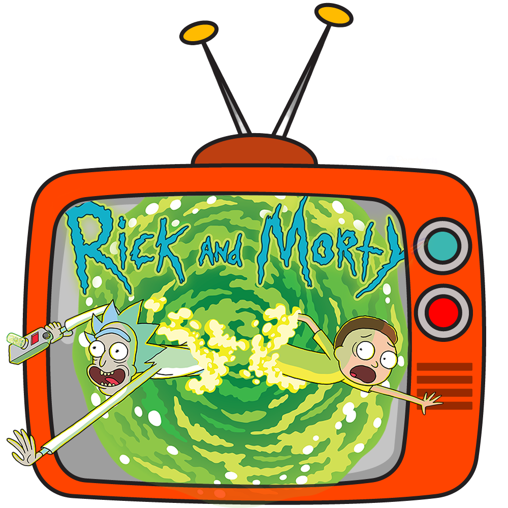

# Rick and Morty Explorer

  

[Live Site](https://koffisonv.github.io/rickandmortywiki/)

## ✨ Overview

Welcome to the Rick and Morty Explorer – an interactive web application that delves into the fantastic world of the beloved TV series, Rick and Morty. Our mission is to introduce users to the captivating universe of the show, showcasing its diverse characters, intriguing locations, and unforgettable episodes. We prioritize user experience, which is why we've designed a sleek, minimalist, and user-friendly website for your enjoyment.

## 🛠️ Tools & Features

**React:** We've built this project using the power of React to ensure a seamless and dynamic user experience.

**Navigation:** The navigation is made easier using a navigation bar that navigate to different pages on the website. A 📺 icon on the home screen that directs the user to a website where they can watch the show, and a next/previous button to display the next elements of the location and character's page.

**Tailwind CSS:** The styling of the app is enhanced by the use of Tailwind CSS, providing a visually appealing and responsive design.

**Rick & Morty API:** To populate the website with rich content, we've integrated the Rick & Morty API, offering you a comprehensive insight into the show's world.

## 🚀 Getting Started

To explore this project, follow these simple steps:

1. Clone this repository to your local machine.
2. Open your terminal and run `npm install` to install the necessary dependencies and configurations.
3. Finally, execute `npm start` in your terminal and witness the magic unfold as you embark on a journey through the Rick and Morty multiverse.

Immerse yourself in the fantastic realm of Rick and Morty – start exploring today!
